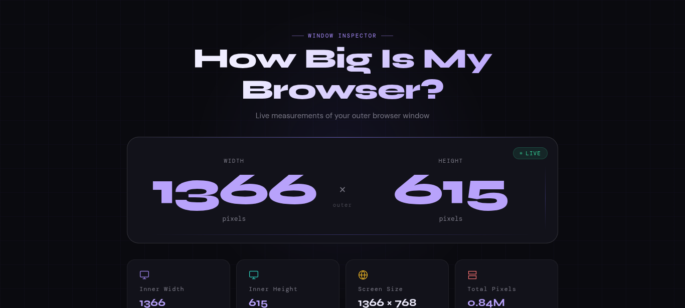
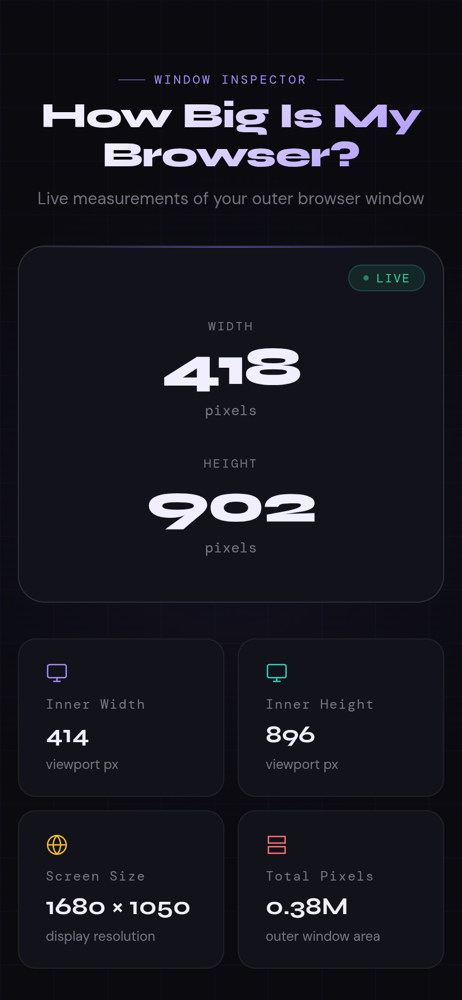
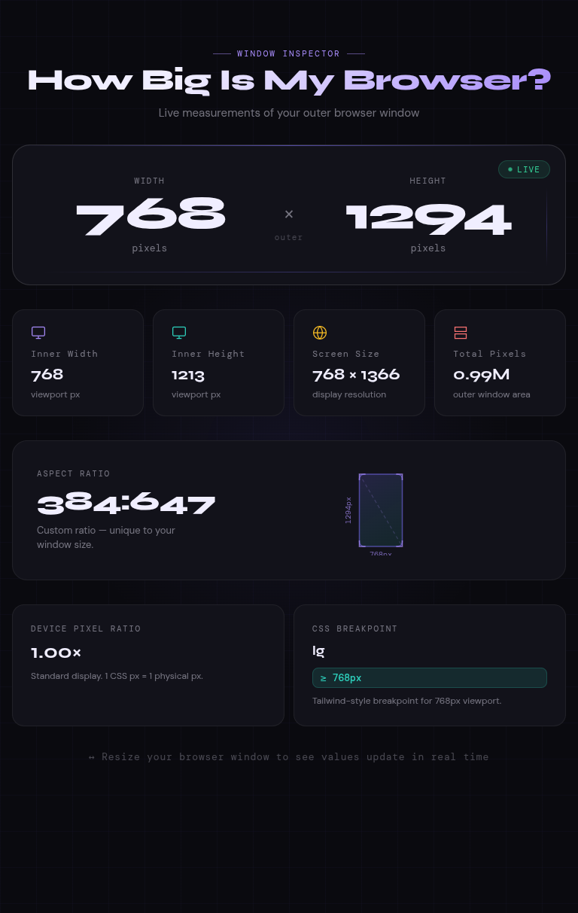

# How Big Is My Browser?

A modern, real-time browser window inspector that displays detailed information about your browser window, viewport, screen, and display characteristics.

## Screenshots

### Desktop View


<p align="center">
  
</p>

### Mobile View

<p align="center">
  
</p>

### Tablet View

<p align="center">
  
</p>

## Preview

Live measurements update instantly as you resize your browser window, including:

- Outer window dimensions
- Inner viewport dimensions
- Screen resolution
- Total window area
- Aspect ratio detection
- Device Pixel Ratio (DPR)
- Responsive breakpoint detection
- Visual aspect-ratio preview

## Features

### 📏 Real-Time Window Measurements

- Outer browser width and height
- Inner viewport width and height
- Live updates during resize events

### 🖥 Display Information

- Screen resolution detection
- Device Pixel Ratio (Retina / HiDPI support)
- Total window pixel area calculation

### 📐 Aspect Ratio Analysis

- Automatic aspect ratio calculation
- Recognition of common ratios:
  - 16:9
  - 16:10
  - 4:3
  - 21:9
  - 32:9
  - 3:2
  - 5:4
  - 1:1
- Interactive visual ratio preview

### 🎯 Responsive Breakpoint Detection

Detects viewport breakpoints similar to Tailwind CSS:

| Breakpoint | Width |
|------------|--------|
| xs | < 480px |
| sm | ≥ 480px |
| md | ≥ 640px |
| lg | ≥ 768px |
| xl | ≥ 1024px |
| 2xl | ≥ 1280px |
| 3xl | ≥ 1536px |

### ✨ Modern UI

- Dark theme
- Responsive layout
- Animated live indicators
- Smooth update effects
- Glassmorphism-inspired design
- Custom aspect-ratio visualizer

---

## Technologies Used

- HTML5
- CSS3
- Vanilla JavaScript
- Canvas API

No frameworks or dependencies required.

## Installation

Clone the repository:

```bash
git clone https://github.com/yourusername/how-big-is-my-browser.git
cd how-big-is-my-browser
```

Open the project:

```bash
open index.html
```

or simply double-click `index.html`.

## Usage

1. Open the page in your browser.
2. Resize the browser window.
3. Watch measurements update in real time.
4. View:
   - Window dimensions
   - Viewport size
   - Screen resolution
   - Aspect ratio
   - Device Pixel Ratio
   - Active responsive breakpoint

## Browser Support

Works in all modern browsers:

- Chrome
- Chromium
- Brave
- Firefox
- Edge
- Safari

## How It Works

The application continuously monitors:

```javascript
window.outerWidth
window.outerHeight
window.innerWidth
window.innerHeight
window.devicePixelRatio
screen.width
screen.height
```

and updates the interface whenever changes are detected.

## Performance

The application uses:

- Resize event listeners
- VisualViewport API (when available)
- Lightweight DOM updates
- Canvas rendering for ratio visualization

No external APIs or network requests are required after page load.

## Project Structure

```text
.
└── index.html
```

Everything is contained in a single self-contained HTML file.

## Future Ideas

- Export measurements as JSON
- Screenshot support
- Window history tracking
- Multi-monitor information
- Full-screen detection
- Browser information panel

## License

MIT License

Feel free to use, modify, and distribute this project.

## Author

Created to provide a clean and visually appealing way to inspect browser and viewport dimensions in real time.
